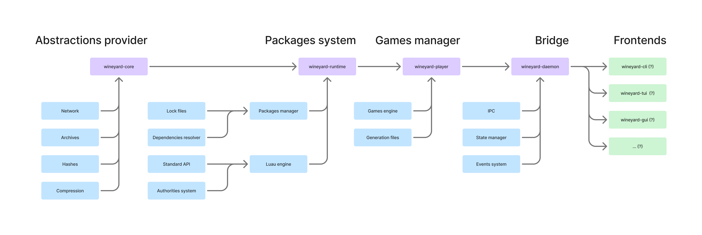

# Wineyard

Highly modularized continuation of the
[universal launcher](https://github.com/an-anime-team/anime-games-launcher)
project.

The new design principle is:

1. Modularize project to simplify maintainance.
2. Use "formats" and "editions" instead of "standards". Instead of providing
   backward compatibility directly in the libraries prefer users-led "polyfill"
   libraries to fill compatibility gaps. When change in engine is planned -
   provide official (optional) compatibility layer for older packages.
3. Maintain state internally, including data cache, loaded packages, etc.
4. Provide reactive interface to the frontend through the events system, avoid
   imperative commands as much as it makes sense.

The new "daemon" application is planned to be a rust binary and library which
will maintain the packages system state internally and provide simple events
and "actions" to the frontend using IPC (in binary mode). Potential frontends
don't need to maintain much of the state themselves - instead they should do
their primary job which is offer UI to the user.

Hopefully this design will allow outside contributors to research the project
and, potentially, provide their own frontends, targeting other platforms. The
main advantage of the "daemon" binary is that now:

1. Frontend is independent from rust and can be written in *any* language as
   far as it can (a) read stdio, and (b) process json data.
2. Frontends can update the daemon binary, the actual backend, without updating
   the whole application, by simply downloading and replacing it in some folder.
